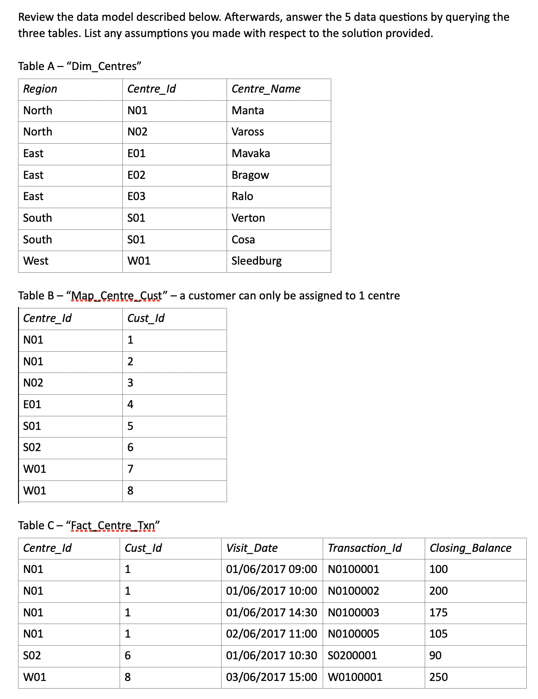

based on https://github.com/jdaarevalo/docker_postgres_with_data

docker-compose down
docker-compose up

# log into image
docker exec -it `docker ps | grep postgres | awk '{print $1;}'` /bin/bash

# populate
psql -U postgres postgres < /docker-entrypoint-initdb.d/create_tables.sql
psql -U postgres postgres < /docker-entrypoint-initdb.d/fill_tables.sql 

#
psql -U postgres

\dt
SELECT * FROM city LIMIT 2;

DB structure:

### EXTRA TABLES + QUESTIONS:

#### Q1: Display the last 100 customers who visited any bank centre and the date of their last visit.

    SELECT Cust_Id, MAX(Visit_Date) FROM Fact_Centre_Txn GROUP BY Cust_Id;

#### Q2: For each customer, display the number of transactions in the bank over the last 60 days.

this misses customers without transactions

    SELECT Cust_Id, COUNT(*)
    FROM Fact_Centre_Txn
    WHERE Visit_Date >= CURRENT_DATE - 60
    GROUP BY Cust_Id;

How select customers with no transactions, this?

    SELECT Cust_Id, COUNT(*) FROM Fact_Centre_Txn WHERE Visit_Date >= CURRENT_DATE - 60 GROUP BY Cust_Id
    UNION
    SELECT Map_Centre_Cust.Cust_Id, 0
    FROM Map_Centre_Cust
    LEFT JOIN Fact_Centre_Txn ON Fact_Centre_Txn.Cust_Id = Map_Centre_Cust.Cust_Id
    WHERE Fact_Centre_Txn.Cust_Id IS NULL AND Fact_Centre_Txn.Visit_Date >= CURRENT_DATE - 6000;

works but is there nicer way?

#### Q3: Produce a list of members who visited the bank more than once in a specific day and show the details of all transactions done in that day.

#### Q4: Display the amount of money kept at each bank centre per day for the current month.
#### Q5: List all bank centres and the number of customers assigned to the centre. In the same output, display the percentage of each centre’s customers with respect to its region.

#### Bonus: From the Q1 result, get the average number of days between the last and second-to-the-last transaction of the last 100 customers who went to the bank.
