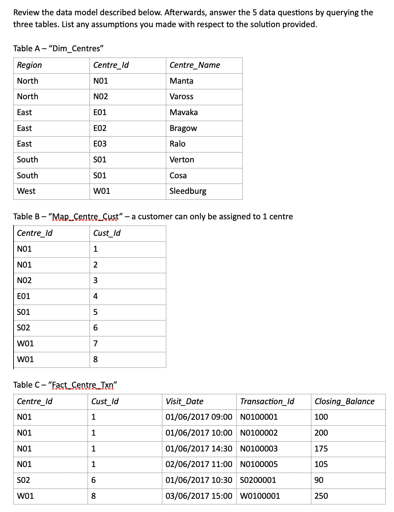

based on https://github.com/jdaarevalo/docker_postgres_with_data

docker-compose down

docker-compose up

# log into image
docker exec -it `docker ps | grep postgres | awk '{print $1;}'` psql -U postgres

# populate

psql -U postgres postgres < /docker-entrypoint-initdb.d/create_tables.sql

psql -U postgres postgres < /docker-entrypoint-initdb.d/fill_tables.sql 

#
psql -U postgres

\dt
SELECT * FROM city LIMIT 2;

---

A select query is evaluated, conceptually, in the following order:

    The from clause
    The where clause
    The group by clause
    The having clause
    The select clause
    The order by clause

The actual physical execution of the statement is determined by the query processor and the order may vary from this list.

    FROM
    ON
    JOIN
    WHERE
    GROUP BY
    WITH CUBE or WITH ROLLUP
    HAVING
    SELECT
    DISTINCT
    ORDER BY
    TOP

---
DB structure:

#

#

### EXTRA TABLES + QUESTIONS:

#### Q1: Display the last 100 customers who visited any bank centre and the date of their last visit.

    SELECT Cust_Id, MAX(Visit_Date)
    FROM Fact_Centre_Txn
    GROUP BY Cust_Id
    LIMIT 100;

#### Q2: For each customer, display the number of transactions in the bank over the last 60 days.

    SELECT map_centre_cust.Cust_Id Cust_Id, COALESCE(VisitCounts.count, 0) Visits
    FROM map_centre_cust
    LEFT JOIN (
        SELECT Cust_Id, COUNT(*) as count
        FROM Fact_Centre_Txn
        WHERE Visit_Date >= CURRENT_DATE - INTERVAL '60 days'
        GROUP BY Cust_Id
    ) AS VisitCounts
    ON map_centre_cust.Cust_Id = VisitCounts.Cust_Id;

test - replace CURRENT_DATE wtih (SELECT ...)

    WITH CD AS (SELECT MAX(visit_date) FROM Fact_Centre_Txn)
    ...
    (SELECT visit_date FROM CD)

other way:

    SELECT Cust_Id, COUNT(*) FROM Fact_Centre_Txn WHERE Visit_Date >= CURRENT_DATE - 60 GROUP BY Cust_Id
    UNION
    SELECT Map_Centre_Cust.Cust_Id, 0
    FROM Map_Centre_Cust
    LEFT JOIN Fact_Centre_Txn ON Fact_Centre_Txn.Cust_Id = Map_Centre_Cust.Cust_Id
    WHERE Fact_Centre_Txn.Cust_Id IS NULL AND Fact_Centre_Txn.Visit_Date >= CURRENT_DATE - 6000;

#### Q3: Produce a list of members who visited the bank more than once in a specific day and show the details of all transactions done in that day.

constants https://stackoverflow.com/questions/1490942/how-to-declare-a-variable-in-a-postgresql-query
WITH Specific_Date AS (values ('2017-01-06 00:00:00')),

Specific_Date = '2017-01-06 00:00:00'

    WITH FrequentingCustomers AS (
        SELECT Cust_Id
        FROM Fact_Centre_Txn
        WHERE date_trunc('day', Visit_Date) = '2017-01-06 00:00:00'
        GROUP BY Cust_Id
        HAVING COUNT(*) > 1
    )
    SELECT centre_id, Fact_Centre_Txn.cust_id cust_id, visit_date, transaction_id, closing_balance
    FROM Fact_Centre_Txn
    JOIN FrequentingCustomers
    ON Fact_Centre_Txn.Cust_Id = FrequentingCustomers.Cust_Id;

or (to use "SELECT *"):

    WHERE Cust_Id IN (SELECT * FROM FrequentingCustomers);

#### Q4: Display the amount of money kept at each bank centre per day for the current month.

    WITH Days AS (
        SELECT DATE('2017-03-10 00:00:00') - interval '1 day' * DayRange.generate_series AS Day
        FROM (SELECT generate_series(0, 100)) AS DayRange)
    SELECT Days.Day, COALESCE(
        SELECT SUM(Closing_Balance)
        FROM (
            SELECT DISTINCT ON (Cust_Id) Closing_Balance
            FROM Fact_Centre_Txn
            WHERE Visit_Date < Days.Day
            ORDER BY Cust_Id, Visit_Date DESC), 0) AS Balance
    FROM Days;

Or run "Balance" subquery once and calculate the rest as sum of deltas.

#### Q5: List all bank centres and the number of customers assigned to the centre. In the same output, display the percentage of each centre’s customers with respect to its region.

    WITH RegionTotals AS (
        SELECT Region, COUNT(*) AS RegionCustomerCount
        FROM Dim_Centres
        JOIN Map_Centre_Cust
        ON Dim_Centres.Centre_Id = Map_Centre_Cust.Centre_Id
        GROUP BY Region),
    CentreCustomers AS (
        SELECT Centre_Id, COUNT(*) AS CentreCustomerCount
        FROM Map_Centre_Cust
        GROUP BY Centre_Id)
    SELECT Dim_Centres.Region Region, Dim_Centres.Centre_Id Centre_Id, CentreCustomerCount, (CentreCustomerCount*100/RegionCustomerCount) AS RegionPercent
    FROM Dim_Centres
    JOIN RegionTotals
    ON Dim_Centres.Region = RegionTotals.Region
    JOIN CentreCustomers
    ON Dim_Centres.Centre_Id = CentreCustomers.Centre_Id
    ORDER BY Dim_Centres.Region;

#### Bonus: From the Q1 result, get the average number of days between the last and second-to-the-last transaction of the last 100 customers who went to the bank.

    WITH CustomerTwoLastVisits AS (
        SELECT DISTINCT ON(Cust_Id) Cust_Id, (LAG(Visit_Date, 0) OVER w) LastDate, (LAG(Visit_Date, 1) OVER w) NextDate
        FROM Fact_Centre_Txn
        WINDOW w AS (PARTITION BY Cust_Id ORDER BY Cust_Id, Visit_Date)
        ORDER BY Cust_Id, Visit_Date DESC)
    SELECT AVG(LastDate - NextDate)
    FROM CustomerTwoLastVisits
    WHERE NextDate IS NOT NULL
    LIMIT 100;

We assume that customers with single visit are not included in the calculation of the average.

#### Tables and fields:

Dim_Centres: Region Centre_Id Centre_Name

Map_Centre_Cust: Centre_Id Cust_Id

Fact_Centre_Txn: Centre_Id Cust_Id Visit_Date Transaction_Id Closing_Balance

## SQL Practice Problems 57 beginning, intermediate, and advanced challenges for you to solve using a learn-by-doing approach by Vasilik, Sylvia Moestl

### Northwind init:

(download [northwind-fix.sql](https://github.com/rgerhardt/57-sql-problems))

    docker exec -it `docker ps | grep postgres | awk '{print $1;}'` /bin/bash
    createdb -U postgres northwind
    psql -U postgres northwind < /northwind/northwind.sql
    psql -U postgres northwind < /northwind/northwind-fix.sql

then run:

    ./connect.sh northwind

or run `\c northwind` after `./connect.sh`

## Solutions:

### Introductory Problems

1. Return all the fields from all the shippers

    SELECT * FROM shippers; -- smpl

2. Categories, only two columns, CategoryName and Description.

    SELECT categoryname, description
    FROM categories; /* \d categories */

3. FirstName, LastName, and HireDate of all the employees with the Title of Sales Representative.

    SELECT FirstName, LastName, HireDate
    FROM employees
    WHERE title = 'Sales Representative';

4. Employees that both have the title of Sales Representative, and also are in the United States.

    SELECT FirstName, LastName, HireDate
    FROM employees
    WHERE title = 'Sales Representative' AND country = 'USA';

5. All the orders placed by a specific employee.

    SELECT *
    FROM orders
    WHERE employeeid = 5;

6. In the Suppliers table, show the SupplierID, ContactName, and ContactTitle for those Suppliers whose ContactTitle is not Marketing Manager.

    SELECT SupplierID, ContactName, ContactTitle
    FROM suppliers
    WHERE contacttitle <> 'Marketing Manager';

or WHERE NOT contacttitle = 'Marketing Manager';

7. ProductID and ProductName for those products where the ProductName includes the string “queso”.

    SELECT ProductID, ProductName FROM products
    WHERE ProductName ILIKE '%queso%'; -- ILIKE is case-insensitive   % === *    _ === .

8. OrderID, CustomerID, and ShipCountry for the orders where the ShipCountry is either France or Belgium.

    SELECT OrderID, CustomerID, ShipCountry
    FROM Orders
    WHERE ShipCountry = 'Belgium' OR ShipCountry = 'France';

9. Orders shipping to any country in Latin America.

    SELECT OrderID, CustomerID, ShipCountry
    FROM Orders
    WHERE ShipCountry IN ('Brazil', 'Mexico', 'Argentin', 'Venezuela');

10. For all the employees in the Employees table, show the FirstName, LastName, Title, and BirthDate. Order the results by BirthDate.

    SELECT FirstName, LastName, Title, BirthDate
    FROM Employees
    ORDER BY BirthDate ASC;

11. Previous + show only the date portion of the BirthDate field.

    SELECT FirstName, LastName, Title, DATE(BirthDate)
    FROM Employees
    ORDER BY BirthDate ASC;

13. Employees full name.

    SELECT FirstName, LastName, CONCAT(FirstName, ' ', LastName) as FullName
    FROM Employees;

or: FirstName || ' ' || LastName as FullName

13. In the OrderDetails table, we have the fields UnitPrice and Quantity. Create a new field, TotalPrice, that multiplies these two together.

    SELECT *, UnitPrice * Quantity AS TotalPrice
    FROM Order_Details;

14. How many customers do we have in the Customers table?

    SELECT COUNT(*) FROM Customers;

15. Show the date of the first order ever made in the Orders table.

    SELECT orderdate
    FROM Orders
    WHERE orderdate IS NOT NULL
    ORDER BY orderdate ASC
    LIMIT 1;

OR

    SELECT MIN(orderdate) FROM Orders;

-

INSERT INTO Orders VALUES(11088,'RATTC',1,NULL,NULL,NULL,2,8.53,'Rattlesnake Canyon Grocery','2817 Milton Dr.','city','code','country');

DELETE FROM Orders WHERE orderid = 11088;

16. Countries where there are customers

    SELECT DISTINCT(country) FROM Customers;

or:

    SELECT country FROM Customers GROUP BY country;

17. Show a list of all the different values in the Customers table for ContactTitles. Also include a count for each ContactTitle.

    SELECT ContactTitle, COUNT(*) AS TotalContactTitle
    FROM Customers
    GROUP BY ContactTitle;

18. For each product show the associated Supplier. Show the ProductID, ProductName, and the CompanyName of the Supplier. Sort by ProductID.

    SELECT ProductID, ProductName, CompanyName
    FROM Products
    INNER JOIN Suppliers
    ON Suppliers.SupplierID = Products.SupplierID
    ORDER BY ProductID;

(just 'JOIN' == 'INNER JOIN')

19. Show a list of the Orders that were made, including the Shipper that was used.
Show the OrderID, OrderDate (date only), and CompanyName of the Shipper, and sort by OrderID.
Show only those rows with an OrderID of less than 10300.

    SELECT OrderID, DATE(OrderDate), Shippers.CompanyName
    FROM Orders
    JOIN Shippers
    ON Orders.shipvia = Shippers.shipperid
    WHERE OrderID < 10300
    ORDER BY OrderID;

### Intermediate Problems

20. Total number of products in each category.
Sort the results by the total number of products.

    SELECT categoryname, COUNT(*) AS total
    FROM Products
    JOIN Categories
    ON Products.categoryid = Categories.categoryid
    GROUP BY Categories.categoryname
    ORDER BY total DESC;

21. Show the total number of customers per Country and City.

    SELECT Country, City, COUNT(*)
    FROM Customers
    GROUP BY Country, City;

22. What products do we have in our inventory that should be reordered?
For now, just use the fields UnitsInStock and ReorderLevel, where UnitsInStock is less than the ReorderLevel, ignoring the fields UnitsOnOrder and Discontinued.
Order the results by ProductID.

    SELECT ProductId, ProductName, UnitsInStock, ReorderLevel
    FROM Products
    WHERE UnitsInStock < ReorderLevel
    ORDER BY ProductID;

23. Prev + define “products that need reordering” with the following:
UnitsInStock plus UnitsOnOrder are less than or equal to ReorderLevel
The Discontinued flag is false (0).

    SELECT ProductId, ProductName, UnitsInStock, ReorderLevel
    FROM Products
    WHERE (UnitsInStock + UnitsOnOrder) <= ReorderLevel AND Discontinued = 0
    ORDER BY ProductID;

24. A list of all customers, sorted by region, alphabetically.
Customers with no region (null in the Region field) to be at the end, instead of at the top, where you’d normally find the null values.
Within the same region, companies should be sorted by CustomerID.

    SELECT customerid, Region FROM Customers
    ORDER BY Region, CustomerID;

or reverse

    SELECT customerid, Region FROM Customers
    ORDER BY
    (CASE
        WHEN Region IS NULL THEN 0
        ELSE 1
    END), Region, CustomerID;

25. Return the three ship countries with the highest average freight overall,
 in descending order by average freight.

    SELECT ShipCountry, AVG(freight) AS AvgFreight
    FROM Orders
    GROUP BY ShipCountry
    ORDER BY AvgFreight DESC
    LIMIT 3;

26. Prev + we only want to see orders from the year 2015.

    WHERE extract(year from OrderDate) = 2015

or

    WHERE date_part('year', OrderDate) = 2015

27. High freight charges with between.

does not apply

28. High freight charges - last year.

    SELECT ShipCountry, AVG(freight) AS AvgFreight
    FROM Orders
    WHERE OrderDate > (SELECT MAX(OrderDate) - INTERVAL '1 year' FROM Orders)
    GROUP BY ShipCountry
    ORDER BY AvgFreight DESC
    LIMIT 3;

30. Inventory list.

    SELECT Employees.EmployeeID, LastName, Orders.OrderID, ProductName, Quantity
    FROM Employees
    JOIN Orders
    ON Employees.employeeid = Orders.employeeid
    JOIN order_details
    ON Orders.orderid = order_details.orderid
    JOIN Products
    ON Products.productid = order_details.productid
    ORDER BY Orders.OrderID, Products.productid;

31. Customers with no orders.

    SELECT Customers.CustomerId
    FROM Customers
    LEFT JOIN Orders
    ON Orders.CustomerId = Customers.CustomerId
    WHERE Orders.OrderId IS NULL;

32. Customers with no orders for EmployeeID 4.

    SELECT Customers.CustomerId
    FROM Customers
    LEFT JOIN (SELECT OrderId, CustomerId FROM Orders WHERE Orders.EmployeeID = 4) AS CustomersOfEmployee
    ON Customers.CustomerId = CustomersOfEmployee.CustomerId
    WHERE CustomersOfEmployee.OrderId IS NULL;

Note that with outer joins, the filters on the where clause are applied after the join.

### Advanced Problems

32. High-value customers.

We want to send all of our high-value customers a special VIP gift.
We're defining high-value customers as those who've made at least
1 order with a total value (not including the discount) equal to $10,000 or more.
We only want to consider orders made in the year 1996.

    SELECT CustomerId, OrderId, SUM(Total)
    FROM (
    SELECT DatedOrders.CustomerId, DatedOrders.OrderId, Order_Details.UnitPrice * Order_Details.Quantity AS Total
    FROM (SELECT * FROM Orders WHERE date_part('year', OrderDate) = 1996) AS DatedOrders
    JOIN Order_Details
    ON DatedOrders.OrderId = Order_Details.OrderId
    ) AS subq GROUP BY OrderId, CustomerId
    HAVING SUM(Total) > 10000;

---

    SELECT Customers.CustomerID, Orders.OrderId, SUM(Order_Details.UnitPrice * Order_Details.Quantity) AS Total
    FROM Customers
    JOIN Orders
    ON Orders.CustomerId = Customers.CustomerId
    JOIN Order_Details
    ON Orders.OrderId = Order_Details.OrderId
    WHERE date_part('year', OrderDate) = 1996
    GROUP BY Customers.CustomerID, Orders.OrderId
    HAVING SUM(Order_Details.UnitPrice * Order_Details.Quantity) > 10000
    ORDER BY Total DESC;

33. Define high-value customers as those who have orders totaling $15,000 or more in 1996.

    SELECT Customers.CustomerID, SUM(Order_Details.UnitPrice * Order_Details.Quantity) AS Total
    FROM Customers
    JOIN Orders
    ON Orders.CustomerId = Customers.CustomerId
    JOIN Order_Details
    ON Orders.OrderId = Order_Details.OrderId
    WHERE date_part('year', OrderDate) = 1996
    GROUP BY Customers.CustomerID
    HAVING SUM(Order_Details.UnitPrice * Order_Details.Quantity) > 15000
    ORDER BY Total DESC;

34. use the discount

    SUM(Order_Details.UnitPrice * Order_Details.Quantity * (1-Order_Details.Discount)) AS Total

35. Show all orders made on the last day of the month.
Order by EmployeeID and OrderID.

    SELECT * FROM Orders
    WHERE OrderDate = date_trunc('month', OrderDate) + INTERVAL '1 month' - INTERVAL '1 day'
    ORDER BY EmployeeID, OrderID;

36. Show the 10 orders with the most line items, in order of total line items.

    SELECT Orders.OrderId, COUNT(*)
    FROM Orders
    JOIN Order_Details
    ON Orders.OrderId = Order_Details.OrderId
    GROUP BY Orders.OrderId
    ORDER BY COUNT(*) DESC
    LIMIT 10;

37. Show a random set of 2% of all orders.

    SELECT * FROM Orders WHERE RANDOM() * 100 < 2;

-- RAND() in Microsoft, accepts seed
-- SELECT setseed(1); in postgres
-- if random ID
-- SELECT * FROM Orders WHERE MOD(OrderId, 50) == 0;

38. Double-entered a line item on an order, with a different ProductID, but the same quantity.
Quantity was 60 or more.

    SELECT DISTINCT(OD1.OrderId)
    FROM Order_Details AS OD1
    JOIN Order_Details AS OD2
    ON OD1.OrderId = OD2.OrderId
    WHERE OD1.Quantity >= 60 AND OD2.Quantity >= 60 AND OD1.Quantity = OD2.Quantity AND OD1.ProductId <> OD2.ProductId
    ORDER BY OD1.OrderID;

---

    SELECT DISTINCT(OrderId)
    FROM Order_Details
    WHERE Quantity >= 60
    GROUP BY OrderId, Quantity
    HAVING COUNT(*) > 1;

39. Double-entry details - show details of prev orders.

    SELECT *
    FROM Order_Details
    WHERE OrderId IN (
    SELECT DISTINCT(OrderId)
        FROM Order_Details
        WHERE Quantity >= 60
        GROUP BY OrderId, Quantity
        HAVING COUNT(*) > 1
    )
    ORDER BY OrderId;

---

    WITH SuspiciousOrders AS (
    SELECT DISTINCT(OrderId)
        FROM Order_Details
        WHERE Quantity >= 60
        GROUP BY OrderId, Quantity
        HAVING COUNT(*) > 1
    )
    SELECT *
    FROM Order_Details
    WHERE OrderId IN (SELECT OrderId FROM SuspiciousOrders)
    ORDER BY OrderId;

40. Double-entry details, derived table.

    SELECT *
    FROM Order_Details
    JOIN (
        SELECT DISTINCT(OrderId)
        FROM Order_Details
        WHERE Quantity >= 60
        GROUP BY OrderId, Quantity
        HAVING COUNT(*) > 1
    ) AS SuspiciousOrders
    ON Order_Details.OrderId = SuspiciousOrders.OrderId
    ORDER BY Order_Details.OrderId;

41. Late orders.

    SELECT * FROM Orders WHERE RequiredDate < ShippedDate;

42. Late orders - which salespeople have the most orders arriving late?

    SELECT EmployeeId, COUNT(*)
    FROM Orders
    WHERE RequiredDate < ShippedDate
    GROUP BY EmployeeId
    ORDER BY COUNT(*) DESC;

43. Late orders vs. total orders

    SELECT TotalOrdersTbl.EmployeeId, (Employees.FirstName || ' ' || Employees.LastName) AS FullName, TotalOrders, LateOrders FROM (
        SELECT EmployeeId, COUNT(*) AS TotalOrders
        FROM Orders
        GROUP BY EmployeeId) AS TotalOrdersTbl
    JOIN (
        SELECT EmployeeId, COUNT(*) AS LateOrders
        FROM Orders
        WHERE RequiredDate < ShippedDate
        GROUP BY EmployeeId
    ) AS LateOrdersTbl
    ON TotalOrdersTbl.EmployeeId = LateOrdersTbl.EmployeeId
    JOIN Employees
    ON LateOrdersTbl.EmployeeId = Employees.EmployeeId;

44. Prev - missing employee

    LEFT JOIN Employees

45. Late orders vs. total orders - fix null.

    case when c.runstatus = 'Succeeded' then 1 else 0 end
    ISNULL(col1, 0 )
    COALESCE(col1, 0 )

-- no ISNULL in postgres
https://stackoverflow.com/questions/16840522/replacing-null-with-0-in-a-sql-server-query

46. Percentage of late orders over total orders.

    GradeCount * 100.0/(select sum(GradeCount) from t)
    ROUND(CAST((Numerator * 100.0 / Denominator) AS FLOAT), 2) AS Percentage

47. fix decimal

ROUND from prev

48. 

    WITH CustomersWithTotals AS ((
    SELECT Customers.CustomerId, 0 AS Total
        FROM Customers
        LEFT JOIN (SELECT * FROM Orders WHERE date_part('year', OrderDate) = 1996) AS DatedOrders
        ON DatedOrders.CustomerId = Customers.CustomerId
        WHERE DatedOrders.OrderId IS NULL)
    UNION (
    SELECT Customers.CustomerId, SUM(Order_Details.Quantity * Order_Details.UnitPrice) AS Total
    FROM Customers
    JOIN Orders
    ON Customers.CustomerId = Orders.CustomerId
    JOIN Order_Details
    ON Orders.OrderId = Order_Details.OrderId
    WHERE date_part('year', OrderDate) = 1996
    GROUP BY Customers.CustomerId
    ))
    SELECT CustomerId, Total, (CASE WHEN Total < 1000 THEN 'Low' ELSE 'High' END) AS Category
    FROM CustomersWithTotals;

-- WHEN o.total BETWEEN 1000 AND 5000 THEN 'Medium'

-- bad for Money

-- coalesce(sum(od.unitprice * od.quantity),0) as total

49. Customer grouping - fix null

“between” works well for integer values.
You'll need to something like this:
when TotalOrderAmount >= 0 and TotalOrderAmount < 1000 then 'Low'

50. show all the defined CustomerGroups, and the percentage in each

    ...
    SELECT Category, COUNT(*) AS TotalInGroup, (COUNT(*) * 100 / (SELECT COUNT(*) FROM CustomersWithTotals)) AS PercentageInGroup
    FROM (
    SELECT CustomerId, Total, (CASE WHEN Total < 1000 THEN 'Low' ELSE 'High' END) AS Category
    FROM CustomersWithTotals) AS CategorisedCustomers
    GROUP BY Category;

51. Use CustomerGroupThreshold table.

    SELECT CustomerGroupThreshold.GroupName
    ...
    JOIN CustomerGroupThreshold
    ON Total >= rangebottom AND Total < rangetop

- if CustomerGroupThreshold had only top range then generate bottom:

    SELECT SND.groupname, COALESCE(MAX(FST.rangetop), 0) AS rangebottom, SND.rangetop
    FROM CustomerGroupThreshold AS FST
    RIGHT JOIN CustomerGroupThreshold AS SND
    ON FST.rangetop < SND.rangetop
    GROUP BY SND.groupname, SND.rangetop;

52. Countries with suppliers or customers.

    SELECT DISTINCT(country)
    FROM (
      SELECT DISTINCT(country) FROM suppliers
      UNION
      SELECT DISTINCT(country) FROM customers
    ) AS countries;

53. 52 v2

    SELECT SupplierCountry.country AS SupplierCountry, CustomerCountry.country AS CustomerCountry
    FROM (
      SELECT DISTINCT(country) FROM suppliers
    ) AS SupplierCountry
    FULL OUTER JOIN (
      SELECT DISTINCT(country) FROM customers
    ) AS CustomerCountry
    ON SupplierCountry.country = CustomerCountry.country;

54. 52 v3

    SELECT COALESCE(SupplierCountry.country, CustomerCountry.country) AS Country, COALESCE(SuppliersCount, 0) SuppliersCount, COALESCE(CustomersCount, 0) CustomersCount
    FROM (
      SELECT Country, COUNT(*) AS SuppliersCount FROM Suppliers GROUP BY Country
    ) AS SupplierCountry
    FULL OUTER JOIN (
      SELECT Country, COUNT(*) AS CustomersCount FROM Customers GROUP BY Country
    ) AS CustomerCountry
    ON SupplierCountry.Country = CustomerCountry.Country
    ORDER BY Country;

55. First order in each country.

    SELECT ShipCountry, CustomerId, OrderId, OrderDate
    FROM (
        SELECT ShipCountry, CustomerId, OrderId, OrderDate,
          ROW_NUMBER() OVER (PARTITION BY ShipCountry ORDER BY OrderDate, OrderID) AS RowNumber
        FROM Orders
    ) tbl WHERE RowNumber = 1;

56. Customers with multiple orders in 5 day period.

    SELECT O1.CustomerID,
            O1.OrderId InitialOrderID,
            O1.OrderDate InitialOrderDate,
            O2.OrderId NextOrderID,
            O2.OrderDate NextOrderDate,
            DATE_PART('day', O2.OrderDate::timestamp - O1.OrderDate::timestamp) AS DaysBetween
    FROM Orders AS O1
    JOIN Orders AS O2
    ON O1.CustomerId = O2.CustomerId
    WHERE O1.OrderId < O2.OrderId AND DATE_PART('day', O2.OrderDate::timestamp - O1.OrderDate::timestamp) < 5
    ORDER BY O1.CustomerId, O1.OrderId;

57. 56 v2 - with windows

    SELECT CustomerId,
        OrderDate,
        (LEAD(OrderDate, 1) OVER (PARTITION BY CustomerId ORDER BY OrderDate)) NextOrderDate
    FROM Orders;

-- WHERE NextOrderDate IS NOT NULL;

answers https://github.com/rgerhardt/57-sql-problems
https://github.com/search?q=SQL+Practice+Problems+57

? https://github.com/jonmullins/SQL_Queries

---

Tally table is, but to make a long story short it is simply a table that has one integer column that is a sequential number from 1 to n, n being the number of rows you need.
MS only?

Rolling windows https://www.red-gate.com/simple-talk/databases/sql-server/t-sql-programming-sql-server/calculating-values-within-a-rolling-window-in-transact-sql/

---

Postgress DATE_DIFF - https://www.sqlines.com/postgresql/how-to/datediff

---

## Window functions

https://www.postgresql.org/docs/9.1/functions.html

https://www.postgresql.org/docs/9.1/functions-window.html

A window function performs a calculation across a set of table rows that are somehow related to the current row.

avg(salary) OVER (PARTITION BY depname)

rank() OVER (PARTITION BY depname ORDER BY salary DESC)

same as row_number() ? https://stackoverflow.com/questions/7747327/sql-rank-versus-row-number

LAG(amount,1) OVER (ORDER BY year) previous_year_sales

---

## stored functions / triggers

CREATE TRIGGER z_min_update
BEFORE UPDATE ON tablename
FOR EACH ROW EXECUTE PROCEDURE suppress_redundant_updates_trigger();

https://www.postgresql.org/docs/9.1/sql-createtrigger.html

https://www.postgresql.org/docs/9.0/sql-createfunction.html

---

## Performance

https://www.postgresql.org/docs/9.1/performance-tips.html

EXPLAIN SELECT * FROM tenk1;

---

## Transactions

BEGIN;
UPDATE accounts SET balance = balance - 100.00
    WHERE name = 'Alice';
SAVEPOINT my_savepoint;
UPDATE accounts SET balance = balance + 100.00
    WHERE name = 'Bob';
-- oops ... forget that and use Wally's account
ROLLBACK TO my_savepoint;
UPDATE accounts SET balance = balance + 100.00
    WHERE name = 'Wally';
COMMIT;
