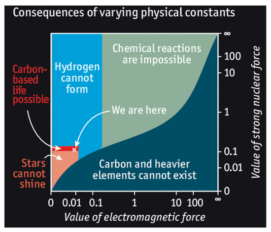

see
http://fai.org.ru/forum/topic/50241-paradoks-fermi-i-multivselennaya/
http://popadancev.net.s3-website-us-east-1.amazonaws.com/paradoks-fermi-i-multivselennaya/

10.1146/annurev-astro-032620-021910

10.1017/S1473550415000208 

def plot(a,b,c, w=1):
  xs, ys = f(a,b,c)
  s = ys[1:] - ys[:-1]
  s = s.clip(min=0)
  if True:
      xs2, ys2 = f(a,b,None)  # no catastrophes for width
      if ys2[-1] > 0.9:
        s2 = ys2[1:] - ys2[:-1]
        s2 = s2.clip(min=0)
      print('w', sum(s2[(a-w)*10:(a+w)*10])/sum(s2))
  print('earth', sum(s[:45])/sum(s), '6gy', sum(s[:60])/sum(s[:45]), '7gy', sum(s[:70])/sum(s[:45]), '8gy', sum(s[:80])/sum(s[:45]))
  plt.plot(xs, ys)
  plt.show()

plot(8, 0.6, None)

