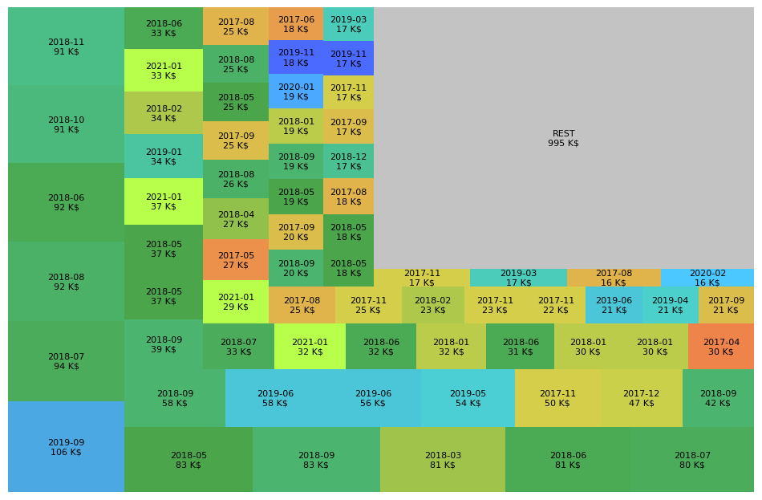

# Analisis of Navalny donation bitcoin transactions.

## Dependencies:

You can skip this part and just reuse my `transactions.txt` file.

Install leveldb support.

 - OSX: `brew install leveldb`
 - Ubuntu: `sudo apt-get install libleveldb-dev`
 - Windows: have no Windows laptop, gift me one or tell me how you managed to install `leveldb` on Windows.
 
Then run:

    pip3 install blockchain-parser

to get [python-bitcoin-blockchain-parser](https://github.com/alecalve/python-bitcoin-blockchain-parser)

## DBs:

You can skip this part and just reuse my `transactions.txt` file.

Get complete Bitcoin blockchain(~350 GB). For example, install Bitcoin Core, uncheck option for blockchain truncation, wait some tens hours.

[Download BTC/USD daily data](http://www.cryptodatadownload.com/data/bitstamp/) to `Bitstamp_BTCUSD_d.csv`

[Confirm correctness of 3QzYvaRFY6bakFBW4YBRrzmwzTnfZcaA6E address.](https://shtab.navalny.com/#donate)

### Generating `transactions.txt` file.

Now point `BITCOIN_BLOCKCHAIN_PATH` in `constants.py` to blockchain files, delete `transactions.txt` and `processed.txt`, run `python3 code.py`. In several hours you will generate new version of file with all incoming transactions.

You can rerun script several times, progress is saved in `processed.txt`

## Analisis:

See [navalny.ipynb](navalny.ipynb)

## Results:

Most valuable transfers size+year.

Count / values of transfers per month:

Mixer / non-mixer comparision:

Day cycle:

What BTC drop of 2018 did.

