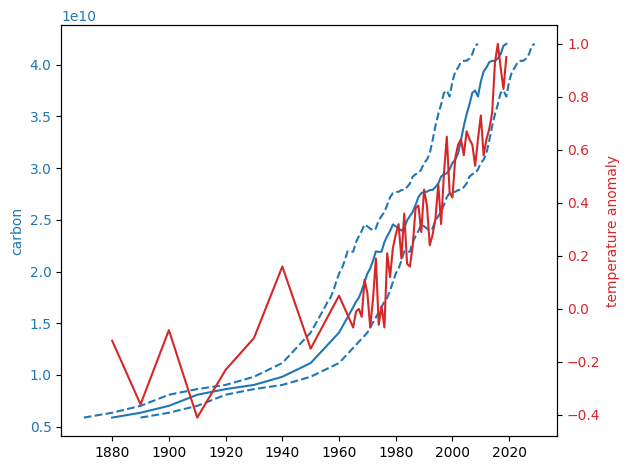

People sometimes tell that rise of temperature could simply coincide with indastrial age. If we talk about coincidence it would be nice to specify exact number of probability. After all 1/2, 1/10^10 and 1/10↑↑10 are probabilities of very different nature.

Lets run `python3 code.py` and look at result - graph of temperature anomalies vs CO2 emissions.

Dotted lines are the same carbon graph moved forward/backward 10 years. So time coincides onn scale of several years.

Aaaand there some ten comparable warmings over a MILLION years.

Now lets divide 5-10 per 100,000...

## Code:

See [code.py](code.py)

## Sources:

**data.json** - NOAA National Centers for Environmental information, Climate at a Glance: Global Time Series, published December 2020, retrieved on December 18, 2020 from [ncdc.noaa.gov](https://www.ncdc.noaa.gov/cag/global/time-series/globe/land_ocean/ann/3/1880-2020)

[global-fossil-fuel-consumption.csv](https://ourworldindata.org/fossil-fuels)

[Land use](https://upload.wikimedia.org/wikipedia/commons/4/46/CO2_Emissions_by_Source_Since_1880.svg) - about 5 GT per year, see
Page 9, Houghton, R. A.; Nassikas, Alexander A. (2017). Global and regional fluxes of carbon from land use and land cover change 1850-2015. Global Biogeochemical Cycles, doi:10.1002/2016GB005546

**bp-stats-review-2018-carbon-emissions-methodology.pdf** - Methodology for calculating CO2 emissions from energy use by BP
uivalent).
    oil at 73,300 kg CO2 per TJ (3.07 tonnes per tonne of oil equivalent); 
    natural gas at 56,100 kg CO2 per TJ (2.35 tonnes per tonne of oil equivalent); 
    and coal at 94,600 kg CO2 per TJ (3.96 tonnes per tonne of oil equivalent
    