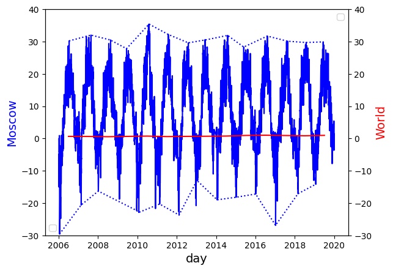
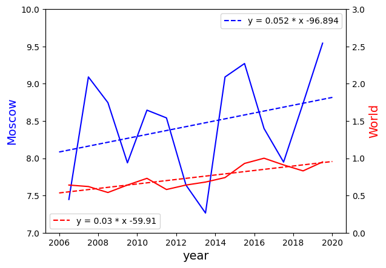
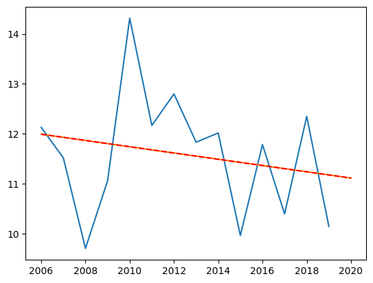

People often see a cold year and use it as evidence against global warming. It would be nice in this case to illustrate typical changes in global temperature year by year and variability of local weather.

We take 15 years of temperature data for Moscow(2005-2019). Run `python3 code.py` to generate following graphs.

Red line is global average temperature and blue - temperature at noon for every day. It is easy to see that envelope of blue curve wiggles much more than world temperature - warming is impossible to notice at this scale.

If we take average yearly temperatures for Moscow and shift graphs to move them close then again we see that local variability is much bigger than global one.

Local temperature can have different trend than global one. For example yearly standard deviation in Moscow is decreasing, because of 2010 record year. But global std_dev is increasing.

[image source](https://www.giss.nasa.gov/research/briefs/hansen_17/)

### Sources:

**csvs.zip** - [Moscow temperature data](https://rp5.ru/%D0%90%D1%80%D1%85%D0%B8%D0%B2_%D0%BF%D0%BE%D0%B3%D0%BE%D0%B4%D1%8B_%D0%B2_%D0%9C%D0%BE%D1%81%D0%BA%D0%B2%D0%B5_(%D0%92%D0%94%D0%9D%D0%A5\))

**data.json** - average global temperatures
NOAA National Centers for Environmental information, Climate at a Glance: Global Time Series, published December 2020, retrieved on December 18, 2020 from [ncdc.noaa.gov](https://www.ncdc.noaa.gov/cag/global/time-series/globe/land_ocean/ann/3/1880-2020)

