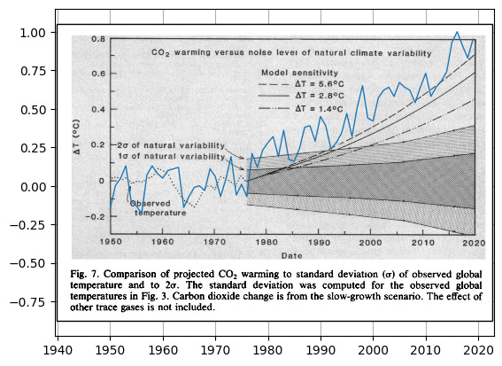

40 years old global warming prediction and modern data.

## Code:

Run `python3 [code.py](code.py)` to generate graph.

We use artificial peaks at 1960, 1960, 2010, 2020 to calibrate fudge values that would combine graphs. Uncomment code after `# test` to add those peaks.

## Sources:

**climate_1981.jpg** - prediction of global temperature from 1981
Fig.7, Climate Impact of Increasing Atmospheric Carbon Dioxide, J.Hansen, Science 28 August 1981, Volume 213, DOI: 10.1126/science.213.4511.957

**data.json** - average global temperatures
NOAA National Centers for Environmental information, Climate at a Glance: Global Time Series, published December 2020, retrieved on December 18, 2020 from [ncdc.noaa.gov](https://www.ncdc.noaa.gov/cag/global/time-series/globe/land_ocean/ann/3/1880-2020)
