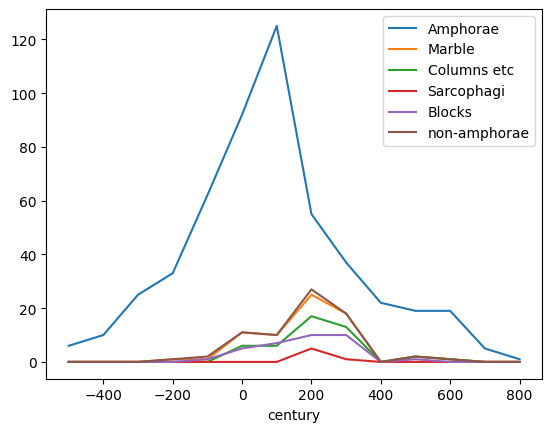

All Roman shipwrecks graph shows peak at 1st century.

But wrecks are discovered mostly thanks to amphoraes and at 2nd century Romans switched to barrels. If we graph wrecks with stone cargoes then we get peak about century later.

Only about 15% of wrecks have proper coordinates. Red markers - wrecks after year 200. It does not look like geography distribution changed.

### Sources:

Strauss, J. (2013). Shipwrecks Database. Version 1.0.
http://oxrep.classics.ox.ac.uk/databases/shipwrecks_database/

